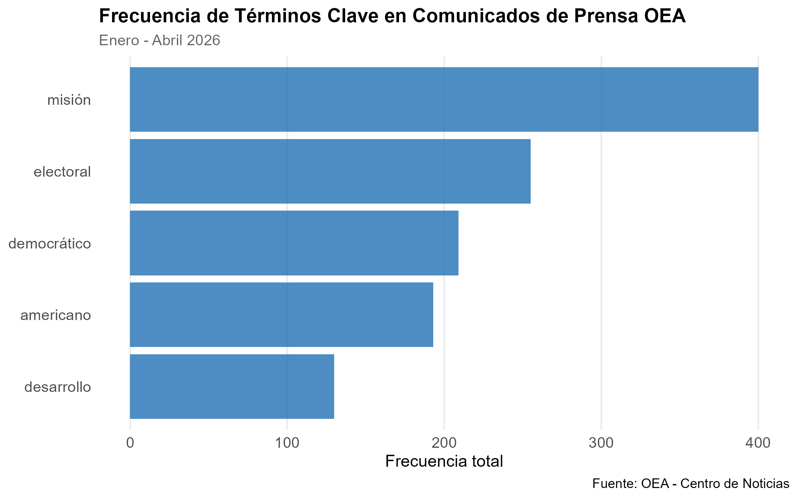

## Introducción

El objetivo de este trabajo es aplicar las herramientas de web scraping y procesamiento de lenguaje natural que estuvimos viendo las últimas clases. Para ello, se estará haciendo web scraping en la página que contiene los comunicados oficiales de la OEA y se extraerá y procesará el texto

## Metodología

Se realizó web scraping sobre los comunicados de prensa de la OEA (Organización de los Estados Americanos) con el objetivo de obtener los comunicados de prensa para los meses de Enero, Febrero, Marzo y Abril del 2026. Una vez obtenidos los datos, se utilizaron técnicas de NLP (Natural Language Processing) para limpiar, lematizar, tokenizar y eliminar stopwords. Por ultimo, se eligieron 5 palabras de entre las 20 más utilizadas y se diseñó un gráfico de barras que incluye estas palabras y su frecuencia de aparición.

```{r}
#| message: false
#| warning: false

library(here)

source(here("TP2/scripts/scraping_oea.R"))
source(here("TP2/scripts/processing.R"))
source(here("TP2/scripts/metrics_figures.R"))
```

## Resultados



## Interpretación

El gráfico presenta la frecuencia de cinco términos seleccionados entre los más recurrentes en los comunicados de prensa de la OEA durante el primer cuatrimestre de 2026.

La prominencia de palabras como **"misión"** (más de 400 menciones), **"electoral"** (aproximadamente 250), **"democrático"** (aproximadamente 210) y **"americano"** (aproximadamente 195) refleja con claridad los pilares fundamentales del mandato institucional de la OEA: el fortalecimiento de la democracia y el acompañamiento de procesos electorales en el continente. El término **"desarrollo"** (aproximadamente 140 menciones), aunque menos frecuente dentro del grupo, evidencia que la organización también sostiene una agenda vinculada al progreso socioeconómico de la región.

En conjunto, estos términos ilustran que la OEA se posiciona públicamente como un organismo orientado a la defensa de valores democráticos, la supervisión electoral y el desarrollo regional, ejes que se ven claramente reflejados en su comunicación institucional.
